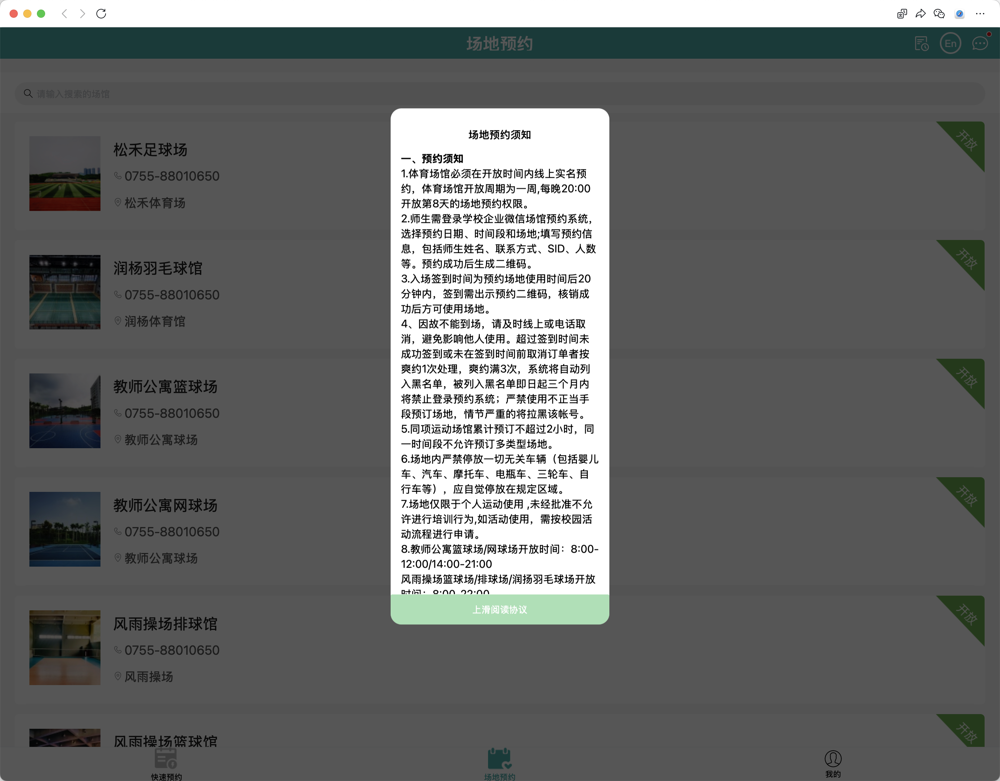
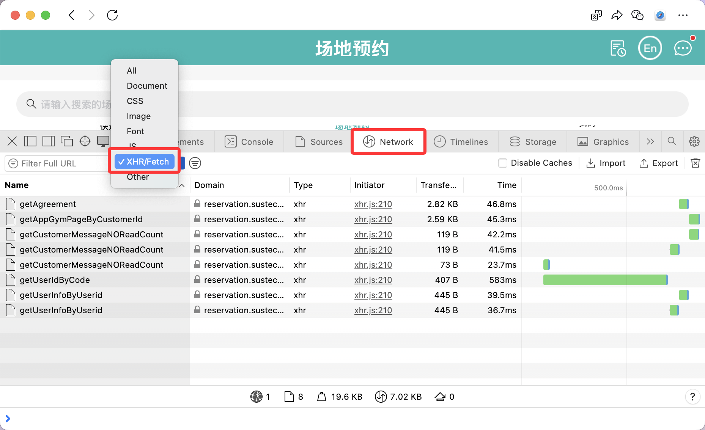
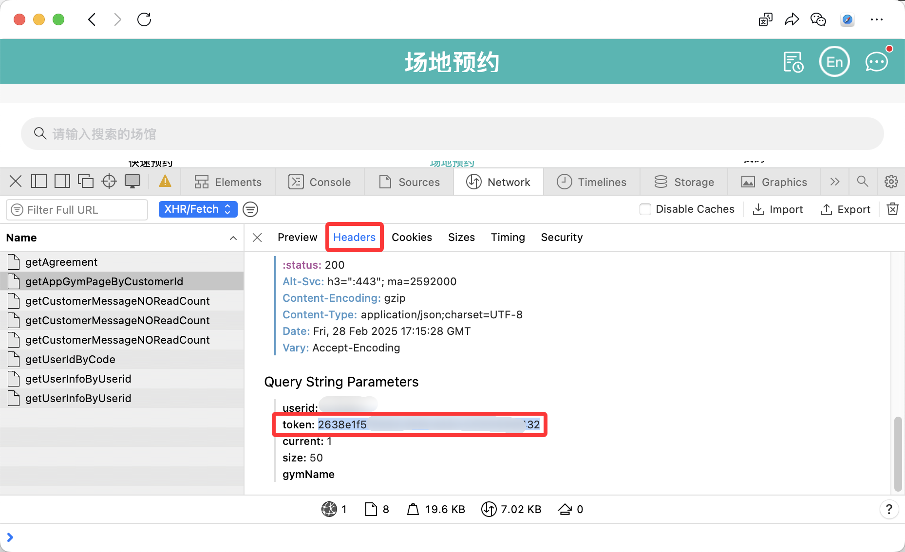
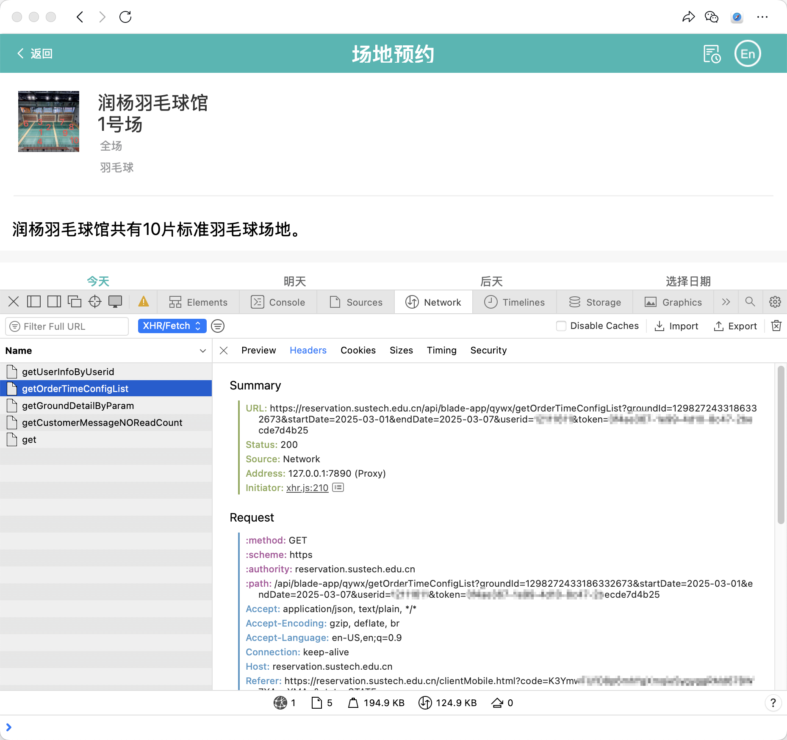

# SUSTech Venue Reserver

## 1. Why you should use a reserver

A reservation is typically from a phone or a computer, which launches a browser to complete. It costs much flow rate and higher load for the server. Hence, I developped this tool, pursuing the simplest way to book a ground efficiently and reduce the load on the server side.

It is available at 2025/03/01.

## 2. Requirements

To run the tool, you must have a Python environment. The library requirements are shown in the `requirements.txt`. It's recommended to use Python 3.10, which is the version that I used to develop this tool. Note that other popular Python versions may also be available, as I didn't conduct any version test.

It would be better if you are good at computer networks.

## 3. Theory for a reserver

Briefly, the path to make a reservation is:

- curl `https://open.weixin.qq.com/connect/oauth2/authorize?appid=CORPID&redirect_uri=REDIRECT_URI&response_type=code&scope=snsapi_base&state=STATE&agentid=AGENTID#wechat_redirect`
- be redirected to `https://reservation.sustech.edu.cn/clientMobile.html?code=CODE&state=STATE#/reservation/gym`
- get a user token by CODE indicated in the url above
- make a reservation based on the token

### (1) The first try to get access to the reservation system

To manually book a ground, we typically use Wechat or WeCom, then click the reservation button in the SUSTech Vene Reservation app and follow its instructions to complete the task. The first thing is, what happened when we click the "场地预约" button. If you click it, the app will launch a built-in browser, and you should choose a ground to book.

For the built-in browser, you can find a dots button at the top right side. If you click it, you can copy the url of the current page. And the url looks like `https://reservation.sustech.edu.cn/clientMobile.html?code=xxxxxxxxx&state=STATE#/reservation/gym`. However, if you use your default browser like Chrome to open it, you will fail due to the OAuth2 authentication and then be redirected to a new page whose url begins with `open.weixin.qq.com`.

Actually, once you click the "场地预约" button, the browser will open the url `https://open.weixin.qq.com/connect/oauth2/authorize?appid=CORPID&redirect_uri=REDIRECT_URI&response_type=code&scope=snsapi_base&state=STATE&agentid=AGENTID#wechat_redirect`. You can find something interesting through a careful review on the redirected url mentioned in the last paragraph. The url looks like `https://open.weixin.qq.com/connect/oauth2/authorize?appid=wx8839ace7048d181b&redirect_uri=https%3a%2f%2freservation.sustech.edu.cn%2fclientMobile.html%23%2freservation%2fgym&response_type=code&scope=snsapi_base&state=STATE&connect_redirect=1#wechat_redirect`, in which you can find the `appid`, `redirect_uri`, and some other parameters. For more information, please refer to the [document](https://developer.work.weixin.qq.com/document/path/96441) published by WeCom Developer Center.

That means, if you want to open the url in your default browser or in a Python script, you must find all of the required parameters mentioned in the WeCom document. Some parameters are easy to find, for example, we have already known that `CORPID` is `wx8839ace7048d181b` and `REDIRECT_URI` is `https%3a%2f%2freservation.sustech.edu.cn%2fclientMobile.html%23%2freservation%2fgym`. Once you complete all of them and open the completed url, you will be redirected to a link in form of `https://reservation.sustech.edu.cn/clientMobile.html?code=CODE&state=STATE#/reservation/gym`. **However, there is a parameter that I failed to find, `AGENTID`, which made me fail to be redirected. Furthermore, it means I failed to get the `CODE` shown in the redirected url, which would be quite important in the following steps. Basically, the administrators of SUSTech have the power to access it. If anyone is able to find it, please raise an issue, and your efforts will simplify the reserver quite much.**

As I failed to find such a `CODE`, I need to find another way.

### (2) Another way to access

Note that the built-in browser is able to fill the `AGENTID`, thus it is able to be redirected to a url contains a `CODE`. Maybe I can give up finding a `CODE` by myself, and just use the `CODE` indicated in the built-in browser.

Let's focus on what are done during a login to the reservation homepage, i.e., the HTTP requests and the responses. The reservation page uses TLSv1.3 to encrypt, and that means, if you use some tools like WireShark to grab the packets, it will be hard to retrieve the HTTP requests. It's recommended to use WireShark to try it out, then you will have a better understanding of what I wrote.

Hopefully, we can use the developer mode of WeCom to grab the HTTP requests. To enter the developer mode, please open the WeCom app and press Ctrl+Alt+Shift+D in windows or Command+Shift+Control+D in MacOS. The following instructions are based on MacOS, and you can do the same thing in Windows.

In the top bar, please follow the figure below to open the Web element inspection. Then right click the reservation page and choose "Inspect Element". Choose "Network" and "XHR/Fetch".

You will find some requests, like `getAgreement`. Just choose one, and click "Headers" then scroll down to the bottom. There is a token that you should take down. Every request has the same token. If there is no token, just move on to another request. Note that the token will expire in about 5 minutes, so if you encounter an error named "鉴权失败2", please reload the page and use the new token.

### (3) How to make a reservation

Based on the token, you can do anything use a script by sending a request as long as you can provided the right url and data. Note that a request contains three important parts, url, data, and header. To find what requests that you can send, you can click the buttons in the page and focus on the requests list shown in the element inspector window.

For example, we open the page shown below and focus on the `getOrderTimeConfigList` request.

